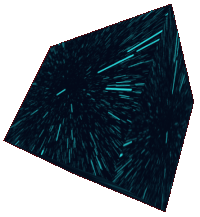

# A-Frame WarpSpeed Texture

Component that set real-time calculated animation on a canvas as texture to the existing material of an entity. The main purpose is testing the (currently) experimental [transferControlToOffscreen](https://developer.mozilla.org/en-US/docs/Web/API/HTMLCanvasElement/transferControlToOffscreen) method.

The animation is an updated version of the existing [WarpSpeed.js](https://github.com/adolfintel/warpspeed) library. There are two was two run the calculation:

1. On the main thread.
2. In a web worker.



**WarpSpeed** is a perfect way to demonstrate how important it is to not to block the main thread because it's highly tweakable until rich significant FPS drops and looks pretty cool.

## Usage

Simple usage is simple, [download](https://raw.githubusercontent.com/SubZtep/aframe-warpspeed-texture/main/awt.min.js) and embed the package and write something like:

```html
<a-box warpspeed></a-box>
```

For more detailed usage check the [demo branch](https://github.com/SubZtep/aframe-warpspeed-texture/tree/demo) and its [**LIVE demonstration** page](https://subztep.github.io/aframe-warpspeed-texture/) with GUI for the properties.

### API

Speed change removed from the original script because of A-Frame's animation capability.

| Property         | Description                                                          | Default Value |
| ---------------- | -------------------------------------------------------------------- | ------------- |
| width            | Texture width in pixel.                                              | 512           |
| height           | Texture height in pixel.                                             | 512           |
| speed            | The speed at which we're moving through the starfield.               | 0.7           |
| density          | Star density.                                                        | 25.7          |
| useCircles       | Drawing squares instead of circles is faster, but looks less pretty. | true          |
| depthAlpha       | Stars that are further from the camera are less opaque. Slower.      | true          |
| warpEffect       | Draws lines instead of just the stars. Slower.                       | true          |
| warpEffectLength | How long the warp strikes are in depth units.                        | 5             |
| starScale        | Size of stars.                                                       | 3             |
| backgroundColor  | Background color.                                                    | #100a1a       |
| starColor        | Star color.                                                          | #ffffff       |
| useWorker        | Run calculations in a web worker.                                    | false         |

If the browser is not capable of running the requirements for web worker calculation `useWorker` automatically set to _false_.

## License

Unlicensed, the _original texture version_ requires [LGPL3+](https://github.com/adolfintel/warpspeed#license) which is not in GitHub templates. :octocat:
